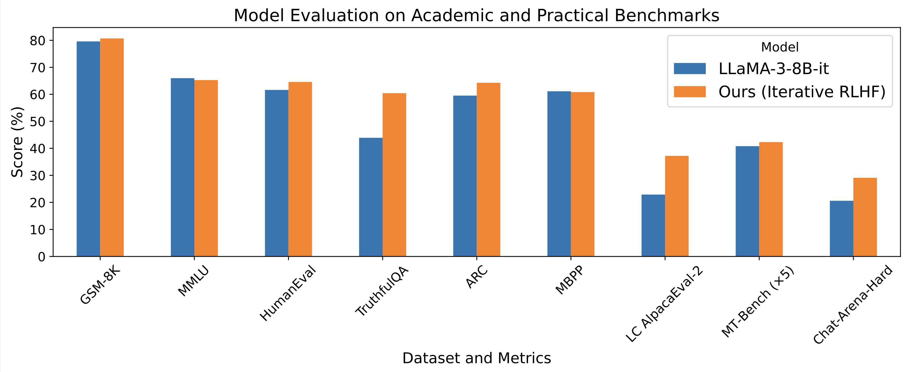

# Online RLHF

TL;DL: this is a repo to align the large language models (LLMs) by [online iterative RLHF](https://arxiv.org/pdf/2312.11456.pdf). Also check out our [technical report](https://arxiv.org/pdf/2405.07863) and [Huggingface Repo](https://huggingface.co/RLHFlow)!

We present the workflow of Online Iterative Reinforcement Learning from Human Feedback (RLHF), which is widely reported to outperform its offline counterpart by a large margin in the recent LLM literature. However, existing open-source RLHF projects are still largely confined to the offline learning setting. In this repo, we aim to fill in this gap and provide a detailed recipe that is easy to be reproduced for online iterative RLHF. In particular, with our recipe, with **only open-source data**, we can achieve comparable or even better results than LLaMA3-8B-instruct. 



## Model Releases
SFT Model: check more SFT checkpoints [Here](https://huggingface.co/collections/RLHFlow/sft-models-66eda119ea7d19a23904da28) and dataset [RLHFlow/RLHFlow-SFT-Dataset-ver2](https://huggingface.co/datasets/RLHFlow/RLHFlow-SFT-Dataset-ver2)
- [RLHFlow/LLaMA3-SFT](https://huggingface.co/RLHFlow/LLaMA3-SFT): v1.0 with 1 epoch training
- [RLHFlow/LLaMA3-SFT-v2](https://huggingface.co/RLHFlow/LLaMA3-SFT-v2): v2.0 with 2 epoch training 
- [RLHFlow/Llama3-SFT-v2.0-epoch1](https://huggingface.co/RLHFlow/Llama3-SFT-v2.0-epoch1)
- [RLHFlow/Llama3-SFT-v2.0-epoch3](https://huggingface.co/RLHFlow/Llama3-SFT-v2.0-epoch3)

Reward Model: also check more reward models [Here](https://huggingface.co/collections/RLHFlow/rlhflow-reward-models-669ecdd1c7e62283cb54b5fd)
- [Reward model](https://huggingface.co/sfairXC/FsfairX-LLaMA3-RM-v0.1): Bradley-Terry model
- [RLHFlow/pair-preference-model-LLaMA3-8B](https://huggingface.co/RLHFlow/pair-preference-model-LLaMA3-8B): generative pairwise preference model
- [RLHFlow/ArmoRM-Llama3-8B-v0.1](https://huggingface.co/RLHFlow/ArmoRM-Llama3-8B-v0.1): multi-head reward model with mixture-of-expert aggregation

RLHF Model: 
- [RLHF model](https://huggingface.co/RLHFlow/LLaMA3-iterative-DPO-final): trained from RLHFlow/LLaMA3-SFT
- [RLHF model v2 iter1](https://huggingface.co/RLHFlow/Llama3-v2-iterative-DPO-iter1): trained from RLHFlow/LLaMA3-SFT-v2
- [RLHF model v2 iter2](https://huggingface.co/RLHFlow/Llama3-v2-iterative-DPO-iter2): trained from RLHFlow/LLaMA3-SFT-v2
- [RLHF model v2 iter3](https://huggingface.co/RLHFlow/Llama3-v2-iterative-DPO-iter3): trained from RLHFlow/LLaMA3-SFT-v2

| Model | LC AlpacaEval | MATH | GSM8K | HumanEval | HumanEval+ | MMLU | ARC-c | Truthful QA |
|----------|----------|----------|----------|----------|----------|----------|----------|----------|
| RLHFlow/LLaMA3-SFT | 12.47 (1146 token) | 30 | 76.9 | 0.634 | 0.561 | 0.6462 | 0.5862 | 0.5345 |
| RLHFlow/LLaMA3-SFT-v2 | 12.66 (1175 token) | 41.1 | 83.4 | 0.665 | 0.616 | 0.648 | 0.5998 | 0.5393 |
| RLHFlow/LLaMA3-iterative-DPO-final (v1) | 30.9 | 31.3 | 82.1 | 0.64 | 0.585 | 0.6545 | 0.628 | 0.6216 |
| RLHFlow/Llama3-v2-iterative-DPO-iter1 | - | 43 | 85.3 | 0.634 | 0.585 | 0.6494 | 0.634 | 0.5955 |
| RLHFlow/Llama3-v2-iterative-DPO-iter2 | - | 43.8 | 84.8 | 0.671 | 0.591 | 0.6477 | 0.651 | 0.6331 |
| RLHFlow/Llama3-v2-iterative-DPO-iter3 | 31.31 (2157 token) | 44.4 | 85.3 | 0.683 | 0.622 | 0.6466 | 0.6596 | 0.6473 |
| meta-llama/Meta-Llama-3-8B-Instruct | 22.9 | 26.3 | 70.2 | 0.64 | 0.567 | 0.6561 | 0.5819 | 0.5166 |
| meta-llama/Llama-3.1-8B-Instruct | 20.9 | 50 | 86.5 | 0.689 | 0.622 | 0.682 | 0.558 | 0.5408 |


## Installation instructions

It is recommended to have two separate environments for **inference** and **training**, respectively. 

**Note that the numpy version should be `numpy<2.0`.  `Numpy 2.0` will encounter unexpected issues!!!**

**SFT Environment**

```shell
conda create -n sft python=3.10.9
conda activate sft

## Get axolotl for general model
git clone https://github.com/OpenAccess-AI-Collective/axolotl
cd axolotl
git checkout 55cc214c767741e83ee7b346e5e13e6c03b7b9fa
pip install -e .

# The test cuda version is 12.1, 12.2. You may need to update the torch version based on your cuda version...
# you may encounter underfined symbol error related to cuda and flash-attn and 2.1.2 can solve it ...
pip3 install torch==2.1.2 torchvision torchaudio
pip install flash-attn

# fix an error of axolotl: ModuleNotFoundError: No module named 'pynvml.nvml'; 'pynvml' is not a package
pip install nvidia-ml-py3
# also edit axolotl/src/axolotl/utils/bench.py (line 6) to: ``from pynvml import NVMLError''


## Get FastChat
git clone https://github.com/lm-sys/FastChat.git
cd FastChat
pip install -e .

git clone https://github.com/WeiXiongUST/RLHF-Reward-Modeling.git
pip install deepspeed
```

You also need to install wandb to record the training and log in with the huggingface accout to access Gemma.

```shell
pip install wandb
wandb login

huggingface-cli login
```


**Inference Environment**

```sh
conda create -n vllm python=3.10.9
conda activate vllm
pip install datasets

# The following code is tested for CUDA12.0-12.2, and CUDA12.6
# To develop llama-3, mistral, gemma-1, 1.1, 2, deepseek you can consider the following vllm version
pip install vllm==0.5.4

pip install accelerate==0.33.0
pip install deepspeed==0.14.5
pip install transformers==4.43.4
pip install numpy==1.26.4 #Note that the numpy version should be `numpy<2.0`.  `Numpy 2.0` will encounter unexpected issues!!!
```

**Training Environment**

```sh
conda create -n rlhflow python=3.10.9
conda activate rlhflow

git clone https://github.com/huggingface/alignment-handbook.git
cd ./alignment-handbook/
git checkout 27f7dbf00663dab66ad7334afb7a1311fa251f41
pip3 install torch==2.1.2 torchvision torchaudio
python -m pip install .
pip install flash-attn==2.6.3
pip install accelerate==0.33.0
pip install huggingface-hub==0.24.7
```

You also need to install the wandb to record the training and login with your huggingface account so that you have access to the LLaMA3 models.

```sh
pip install wandb==0.17.7

wandb login
huggingface-cli login
```

## Get Started
We present a step-by-step guidance in this section. 

### Step 1 Supervised Fine-tuning
We need to process the SFT data into the standard format. See [RLHFlow/RLHFlow-SFT-Dataset-ver2](https://huggingface.co/datasets/RLHFlow/RLHFlow-SFT-Dataset-ver2) for an eample. 

```sh
cd sft
torchrun --nproc_per_node 8 --master_port 20001 -m axolotl.cli.train llama3-8b-it.yaml
```

You can also modify the learning rate, batch size, output_path.. with either command or modify the ScriptArguments in the llama3-8b-it.yaml. If you encounter out-of-memory issue. Running the code with Gemma-2b-it with deepspeed stage 3 and gradient checkpoint (set in the config).

```sh
torchrun --nproc_per_node 8 --master_port 20001 -m axolotl.cli.train llama3-8b-it.yaml --deepspeed ../configs/deepspeed_stage3.json
```

### Step 2 Reward Modeling
We refer the interested readers to [this repo](https://github.com/RLHFlow/RLHF-Reward-Modeling) for a detailed recipe to train the state-of-the-art open-source reward/preference models. We have trained several RMs and prepared them on the huggingface like [sfairXC/FsfairX-LLaMA3-RM-v0.1](https://huggingface.co/sfairXC/FsfairX-LLaMA3-RM-v0.1), [RLHFlow/pair-preference-model-LLaMA3-8B](https://huggingface.co/RLHFlow/pair-preference-model-LLaMA3-8B), [RLHFlow/ArmoRM-Llama3-8B-v0.1](https://huggingface.co/RLHFlow/ArmoRM-Llama3-8B-v0.1), which are SOTA open-source RMs so far (2024 May).

### Step 3.1 Data Generation
We have prepared some prompt sets on huggingface.
- UltraFeedback RLHFlow/ultrafeedback_iter1, RLHFlow/ultrafeedback_iter2, RLHFlow/ultrafeedback_iter3
- RLHFlow/iterative-prompt-v1-iter1-20K, RLHFlow/iterative-prompt-v1-iter2-20K, RLHFlow/iterative-prompt-v1-iter3-20K ...

To accelerate data generation, we use the VLLM. We prepare two ways of using VLLM to inference for a more robust implementation, where you can try them out and choose the one that fits with your environment best. We use LLaMA3-8B as an example. 

You may create a test_gen.sh file, and copy the following contents into the file and run ``bash test_gen.sh''.

```sh
# First approach: initialize 4 VLLM processes and split the prompt set to the 4 agents
# The generated samples will be stored at output_dir + local_index + ".jsonl

my_world_size=8 # how many gpu you use
infer_model=RLHFlow/LLaMA3-SFT
prompt_dir=RLHFlow/test_generation_2k
mkdir data
output_dir=./data/gen_data

conda activate vllm
CUDA_VISIBLE_DEVICES=0 python ./generation/gen_hf2.py --model_name_or_path ${infer_model} --dataset_name_or_path ${prompt_dir} --output_dir ${output_dir} --K 4 --temperature 1.0 --local_index 0 --my_world_size ${my_world_size}  &
CUDA_VISIBLE_DEVICES=1 python ./generation/gen_hf2.py --model_name_or_path ${infer_model} --dataset_name_or_path ${prompt_dir} --output_dir ${output_dir} --K 4 --temperature 1.0 --local_index 1 --my_world_size ${my_world_size}  &
CUDA_VISIBLE_DEVICES=2 python ./generation/gen_hf2.py --model_name_or_path ${infer_model} --dataset_name_or_path ${prompt_dir} --output_dir ${output_dir} --K 4 --temperature 1.0 --local_index 2 --my_world_size ${my_world_size}  &
CUDA_VISIBLE_DEVICES=3 python ./generation/gen_hf2.py --model_name_or_path ${infer_model} --dataset_name_or_path ${prompt_dir} --output_dir ${output_dir} --K 4 --temperature 1.0 --local_index 3 --my_world_size ${my_world_size}  &
CUDA_VISIBLE_DEVICES=4 python ./generation/gen_hf2.py --model_name_or_path ${infer_model} --dataset_name_or_path ${prompt_dir} --output_dir ${output_dir} --K 4 --temperature 1.0 --local_index 4 --my_world_size ${my_world_size}  &
CUDA_VISIBLE_DEVICES=5 python ./generation/gen_hf2.py --model_name_or_path ${infer_model} --dataset_name_or_path ${prompt_dir} --output_dir ${output_dir} --K 4 --temperature 1.0 --local_index 5 --my_world_size ${my_world_size}  &
CUDA_VISIBLE_DEVICES=6 python ./generation/gen_hf2.py --model_name_or_path ${infer_model} --dataset_name_or_path ${prompt_dir} --output_dir ${output_dir} --K 4 --temperature 1.0 --local_index 6 --my_world_size ${my_world_size}  &
CUDA_VISIBLE_DEVICES=7 python ./generation/gen_hf2.py --model_name_or_path ${infer_model} --dataset_name_or_path ${prompt_dir} --output_dir ${output_dir} --K 4 --temperature 1.0 --local_index 7 --my_world_size ${my_world_size}  &

# then, we merge the 8 datasets into one dataset.
wait
python ./generation/merge_data.py --base_path ${output_dir} --output_dir ./data/gen_data.json --num_datasets ${my_world_size}
```

We can also use API server to generate new responses.

```sh
mkdir data
conda activate vllm

# register the api server
bash ./generation/register_server.sh RLHFlow/LLaMA3-SFT

# start to generate
python ./generation/gen_hf.py --ports 8000 8001 8002 8003 8004 8005 8006 8007 --tokenizer RLHFlow/LLaMA3-SFT --dataset_name_or_path RLHFlow/test_generation_2k --output_dir ./data/gen_data.jsonl --K 4 --temperature 1.0
```

### Step 3.2 Data Annotation
Then, we call the reward/preference model trained in step 2 to rank the generated responses. 

```sh
accelerate launch ./annotate_data/get_rewards.py --dataset_name_or_path ./data/gen_data.jsonl --output_dir ./data/data_with_rewards.jsonl --K 4
```
If you encounter error ``TypeError: Got unsupported ScalarType BFloat16'', considering adjusting your transformer version.

### Step 3.3 Training

```sh
conda activate rlhflow
accelerate launch --config_file ./configs/zero2.yaml dpo_iteration/run_dpo.py ./configs/training.yaml
```
If you encounter ``RuntimeError: CUDA error: invalid device ordinal, CUDA kernel errors might be asynchronously reported at some other API call'', you need to adjust num_of_process in the config file according to your GPUs.

### Putting Everything Together
We put everything together so that the iterative training can run automatically. Note that we set sleep 1m to wait for registering the API for inference. You may need to adjust this parameter according to your environment.

```sh
bash run_loop2.sh
```

## Acknowledgement

The authors would like to thank the great open-source communities, including the Huggingface TRL team, the Huggingface H4 team, the Allen Institute AI RewardBench team, the Meta LLaMA team, evalplus team and Axolotl team for sharing the models, codes, and training sets. 

## Citation

If you find the content of this repo useful, please consider cite it as follows:

```bibtex
@misc{dong2024rlhf,
      title={RLHF Workflow: From Reward Modeling to Online RLHF}, 
      author={Hanze Dong and Wei Xiong and Bo Pang and Haoxiang Wang and Han Zhao and Yingbo Zhou and Nan Jiang and Doyen Sahoo and Caiming Xiong and Tong Zhang},
      year={2024},
      eprint={2405.07863},
      archivePrefix={arXiv},
      primaryClass={cs.LG}
}
@inproceedings{xiong2023iterative,
  title={Iterative preference learning from human feedback: Bridging theory and practice for RLHF under KL-constraint},
  author={Xiong, Wei and Dong, Hanze and Ye, Chenlu and Wang, Ziqi and Zhong, Han and Ji, Heng and Jiang, Nan and Zhang, Tong},
  booktitle={ICLR 2024 Workshop on Mathematical and Empirical Understanding of Foundation Models}
}
```
